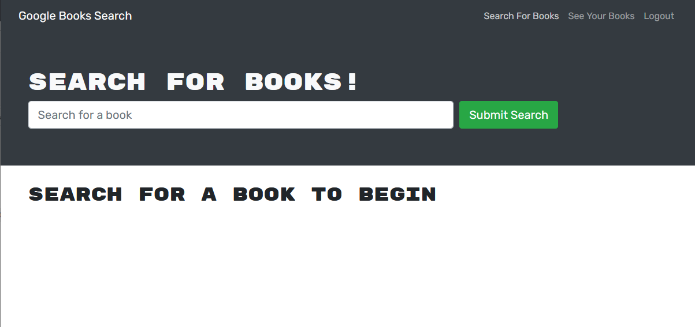
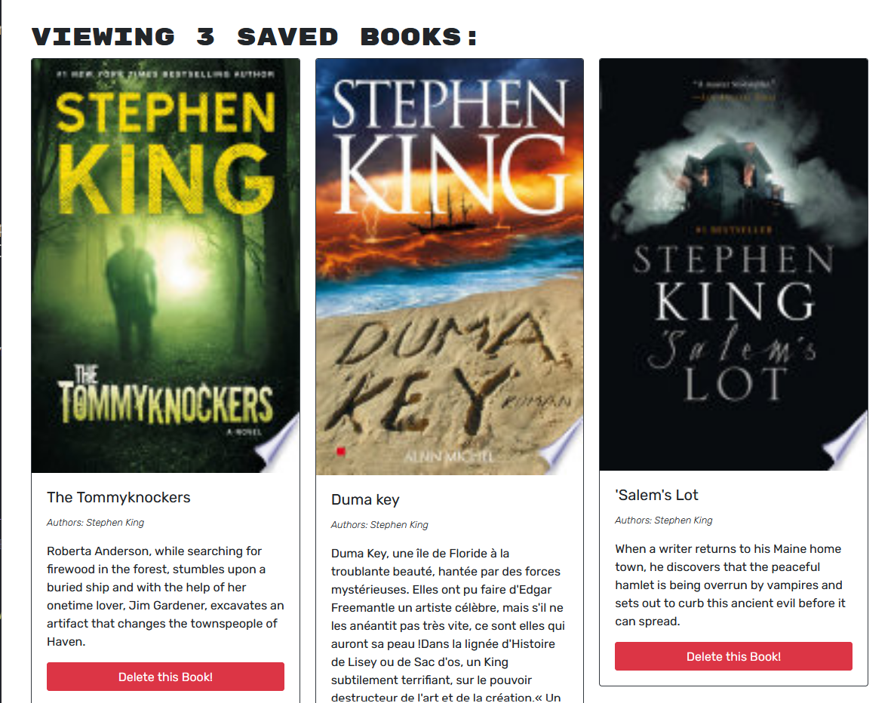

# GraphQL-book-search
Fullstack app that utilizes GraphQL and Google Books API

# Description

This is a small app that was an exercise in converting a REST API into a GraphQL API utilizing the Google Books Search API as well. All of the original REST API handling was left as commented code as a comparison. The demo linked below uses just the GraphQL API.

## Installation

Fork the repo then run:

    npm install

This will install all dependencies for both the front-end and the back-end. Note: Front-end is based on create-react-app, and the back-end is an Express app with Apollo-Server for GraphQL.

## Usage

The landing page is a simple search box along with sign-up/login functionality:

After searching, you can save a book to your collection with the button at the bottom of each result:

Any book saved can be viewed or removed from your collection on your profile page:

## Demo

A live demo of the app is at https://frozen-escarpment-54534.herokuapp.com/

If you don't wish to create an account, you can use the credentials below which act as a test account:

email: test-account@email.com

password: password01

## Questions

Please submit any questions as an issue on the github repo, or directly to me through github.